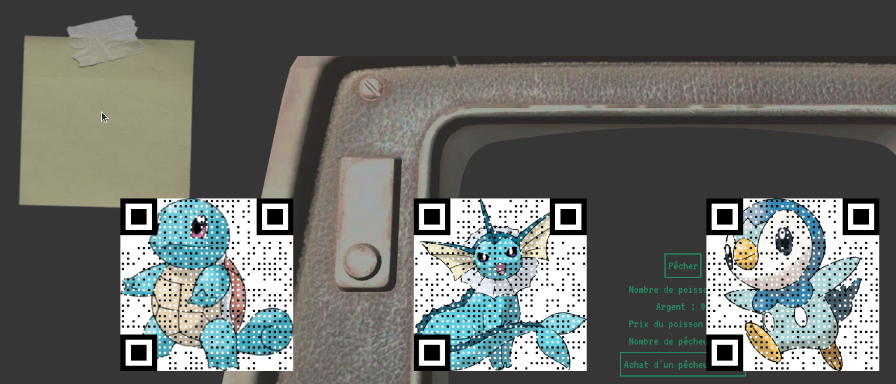

# Nuit-Info-2024

Ce projet à été réalisé par 8 étudiants de l'USMB de la L1 au M2 l'occasion de la nuit de l'info édition 2024. Il s'agit d'un jeu web svelte sur le thème des océans.

## Le jeu

Pour commencez, resolvez la captcha spéciale que nous avons faite (en réalité l'icone sur laquelle il faut cliquer n'est pas forcément celle indiqué pour des raisons involontaires (nous rappelons que le jeux à été codé en une seul nuit !)).

Vous pourrez ensuite commencer à jouer. Il s'agit d'un jeu de type clicker. Pechez et achetez des pécheurs pour commencer à générer de l'argent !

Vous serez parfois confrontés à des choix qui seront décisifs par la suite !

Des informations sur les conséquences de vos actes vous serons indirectement communiquées via les informations communiquées par les journaux.

## Vidéo de la nuit de l'info

A l'aide du stickers d'information en haut à gauche vous pourrez accédez au QR codes des vidéo communiquées par les organisateurs de la nuit de l'info.

## Installation du jeu

Il suffit de cloner le projet puis d'ouvrir le projet en local.

Pour ce faire, exécutez dans un terminal :
- npm install
- npm run dev

Vous obtiendrez alore une adresse locale. Ouvrez la sur un navigateur et le tour est joué.

## Crédits
- [PHILIPPE Teva](https://github.com/TevaPhilippe05)
- [ARNOUX Martin](https://github.com/MartinArnoux)
- [MOIROUD Elliott](https://github.com/moiroudelliott)
- [FAUCON Chloé](https://github.com/bulbiii)
- [TROGNON Julie](https://github.com/jtrognon)
- [DI LUNA Tommy](https://github.com/TommyDIL)
- [FERRUCCI Hugo](https://github.com/ModeusOperandis)
- [MALABRE Etienne](https://github.com/lasnelus)
